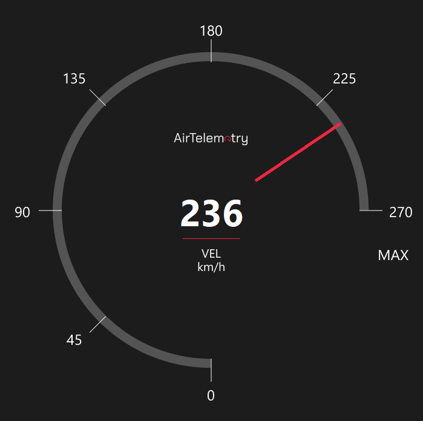
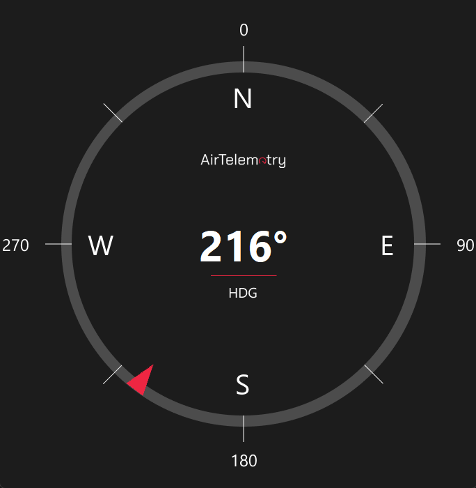

# AirTelemetry - Flight Instruments GUI's with Python

AirTelemetry is a Python-based project utilizing Tkinter to create minimal GUI interfaces for aircraft navigation instruments. This project aims to provide an easy-to-use and visually appealing set of tools for simulating and displaying key aircraft navigation data. 

## Features

- **Airspeed Indicator**: Visual representation of the aircraft's speed.
- **Heading Indicator**: Displays the aircraft's current heading direction.
- **Coming Soon**:
  - **Attitude Indicator**: Shows the aircraft's orientation relative to the horizon.
  - **Altimeter**: Indicates the aircraft's altitude above sea level.
  - **Turn Coordinator**: Displays the rate of turn and coordination.
  - **Vertical Speed Indicator**: Measures the rate of climb or descent.

## Notes
Airspeed Indicator's needle is capped to 270 kph but the display will keep printing as needed.

## Screenshots

## Sample Usage Code
*To be updated