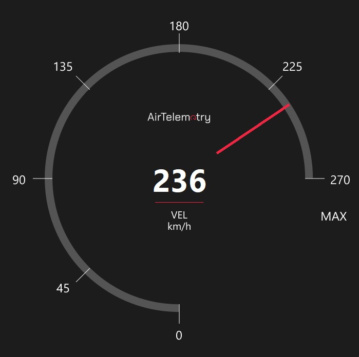
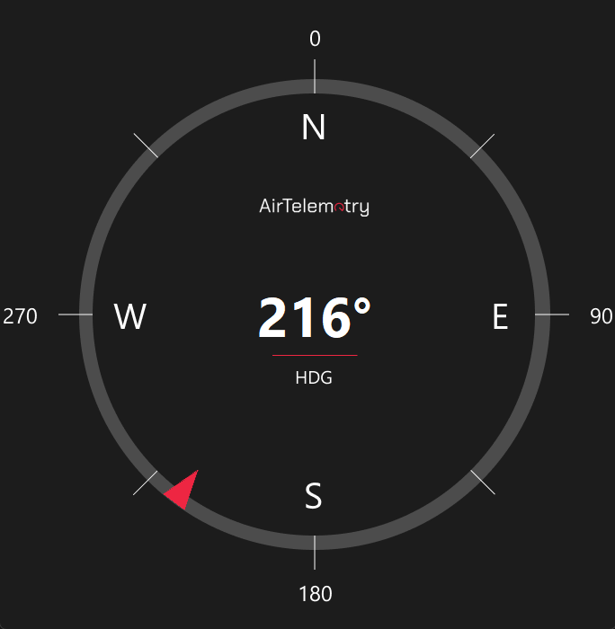

# AirTelemetry - Flight Instruments GUI's with Python

AirTelemetry is a Python-based project utilizing Tkinter to create minimal GUI interfaces for aircraft navigation instruments. This project aims to provide an easy-to-use and visually appealing set of tools for simulating and displaying key aircraft navigation data.

## Features

- **Airspeed Indicator**: Visual representation of the aircraft's speed.
- **Heading Indicator**: Displays the aircraft's current heading direction.
- **Attitude Indicator**: Shows the aircraft's orientation relative to the horizon.
- **Altimeter**: Displays altitude (ft MSL), flight level, and barometric pressure (hPa) with three rotating hands (100ft, 1000ft, 10000ft).
- **Coming Soon**:
  - **Turn Coordinator**: Displays the rate of turn and coordination.
  - **Vertical Speed Indicator**: Measures the rate of climb or descent.

## Dependencies

- Python 3.12+
- [Pillow](https://pypi.org/project/Pillow/)
- [sv-ttk](https://pypi.org/project/sv-ttk/)

```bash
pip install Pillow sv-ttk
```

## Sample Usage

```python
import tkinter as tk
from attitude import AttitudeIndicator
from compass import RotatingCompass
from speedometer import AnalogSpeedometer
from altimeter import Altimeter

root = tk.Tk()
root.geometry("700x700")

# All instruments default to 700x700, just pass the parent
ai = AttitudeIndicator(root)
ai.update_attitude(pitch=15, roll=30)

compass = RotatingCompass(root)
compass.set_heading(270)

speedo = AnalogSpeedometer(root)
speedo.set_speed(180)

alt = Altimeter(root)
alt.update_altitude(5280)

# Override size if needed
small_compass = RotatingCompass(root, width=400, height=400)
```

Each instrument can also be run standalone with a built-in demo:
```bash
python attitude.py
python compass.py
python speedometer.py
python altimeter.py
```

## Notes
Airspeed Indicator's needle is capped to 270 kph but the display will keep printing as needed.

## Screenshots




## Current Status
- **Airspeed Indicator**: Completed
- **Heading Indicator**: Completed
- **Attitude Indicator**: Completed
- **Altimeter**: Completed
- **Turn Coordinator**: Researching
- **Vertical Speed Indicator**: Not started